## Include:

- Register, login with validation form.
- Quick login with Google, Facebook.
- Forgot password, reset password and register a new account by Email verification.
- Update personal information (name, password and avatar)
- Change permissions and delete user accounts with Admin.
- Document upload
- Document tracking

## Install

1. `npm install` или `yarn install`
2. Delete `keys-example.env` file at `server/src/config/`.
3. Create `keys.env` file at `server/src/config/` and enter your values in it. More on this below.

   ```
   NODE_ENV=development
   PORT=
   MONGODB_URI=
   CLIENT_URL=

   ACTIVATION_TOKEN_SECRET=
   ACCESS_TOKEN_SECRET=
   REFRESH_TOKEN_SECRET=

   MAILING_SERVICE_CLIENT_ID=
   MAILING_SERVICE_CLIENT_SECRET=
   MAILING_SERVICE_REFRESH_TOKEN=
   # From
   SENDER_EMAIL_ADDRESS=

   GOOGLE_SECRET=

   CLOUD_NAME=
   CLOUD_API_KEY=
   CLOUD_API_SECRET=
   ```

<div align="center">
  <h3 style="margin-top: 50px; font-size: 35px">MAILING_SERVICE_CLIENT_SECRET and MAILING_SERVICE_CLIENT_SECRET</h3>
  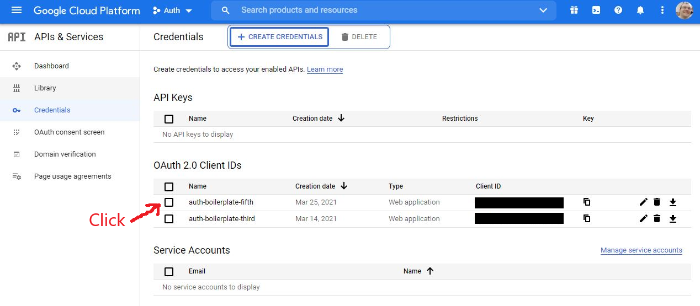
  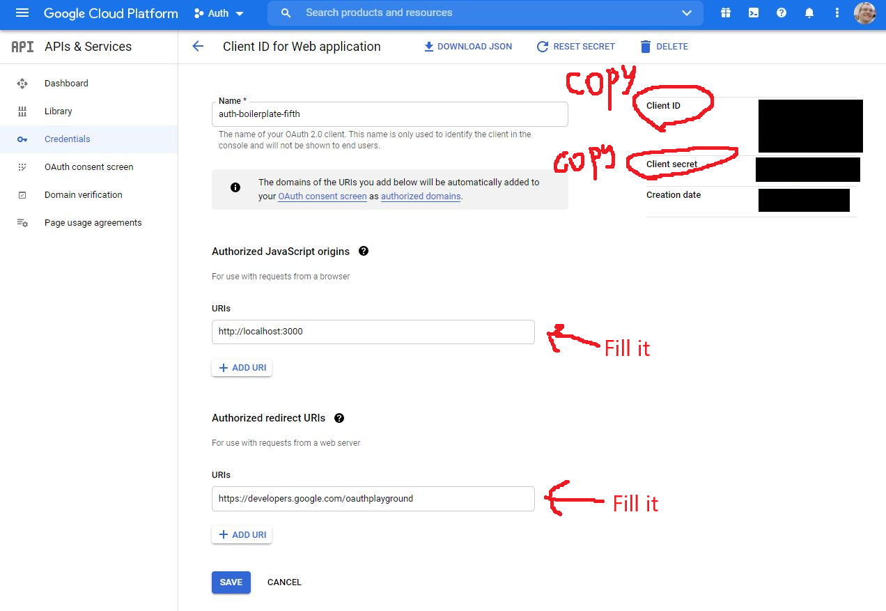
  <h3 style="margin-top: 50px; font-size: 35px"><a href="https://developers.google.com/oauthplayground">Enter to oauthplayground</a></h3>
  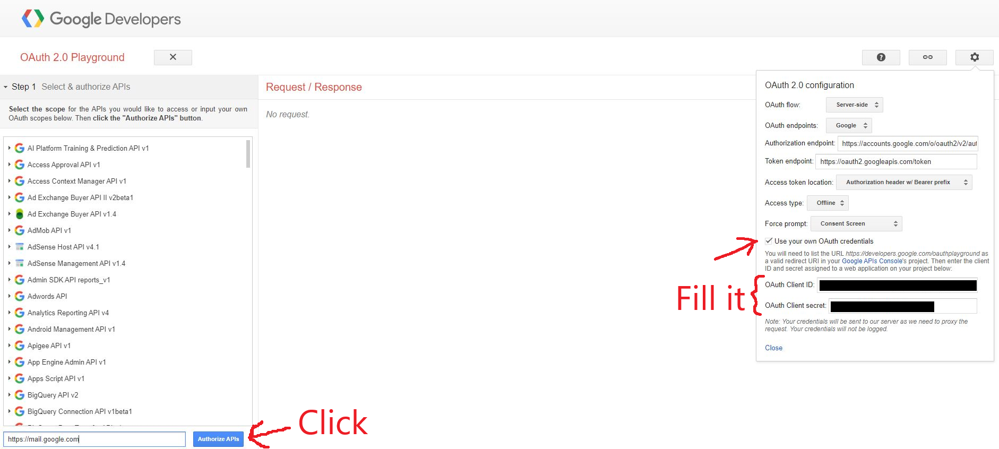
  <h3 style="margin-top: 50px; font-size: 35px">MAILING_SERVICE_REFRESH_TOKEN</h3>
  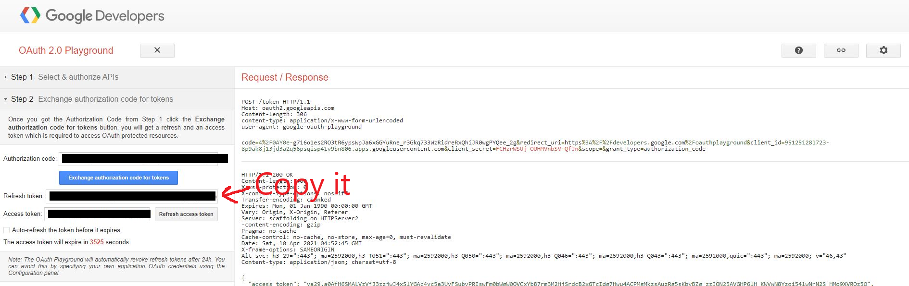
  <h3 style="margin-top: 50px; font-size: 35px">Cloudinary</h3>
  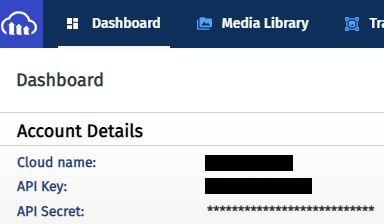
</div>

4. Create `.env` file at `client/` and enter your values in it. More on this below.

   ```
    NODE_ENV=development
    REACT_APP_GOOGLE_CLIENT=
    REACT_APP_FACEBOOK_CLIENT=
   ```

<div align="center">
  <h3 style="margin-top: 50px; font-size: 35px">Facebook</h3>
  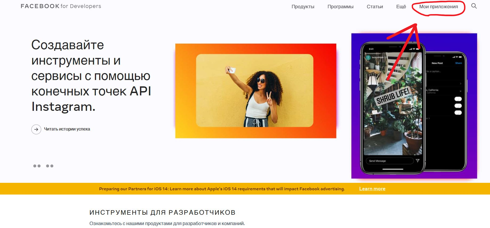
  
  
  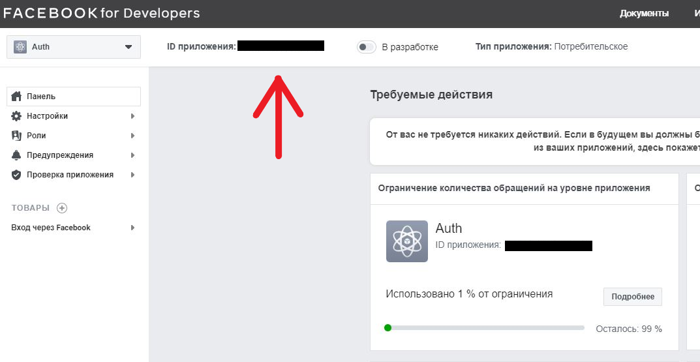
</div>

5. Install MongoDB and start it.

6. Run command `npm run start` or `yarn start` on client and command `npm run dev` or `yarn dev` on server.

## Possible problems

```js
  ./src/index.js 1:85
  Module parse failed: Unexpected token (1:85)
  File was processed with these loaders:
  * ./node_modules/@pmmmwh/react-refresh-webpack-plugin/loader/index.js
  * ./node_modules/react-scripts/node_modules/babel-loader/lib/index.js
  You may need an additional loader to handle the result of these loaders.
  > $RefreshRuntime$ = require('YOUR_PATH');
  | $RefreshSetup$(module.id);
  |
```

**Decision** - switch from react-scripts@4.0.x to 4.0.1

## Built With

### Frontend

- ReactJS + hooks
- React-router-dom
- PropTypes
- Axios
- React-facebook-login
- React-google-login

### Backend

- NodeJS / Express
- MongoDB / Mongoose
- Cors
- Bcrypt
- JsonWebToken
- Cloudinary
- Google-auth-library
- Nodemailer
- Morgan
- Node-fetch
- Cookie-parser
- Express-fileupload

## <a name="screenshots">Screenshots</a>

<div align="center">
  <h3 style="margin-top: 50px; font-size: 35px">Admin page</h3>
  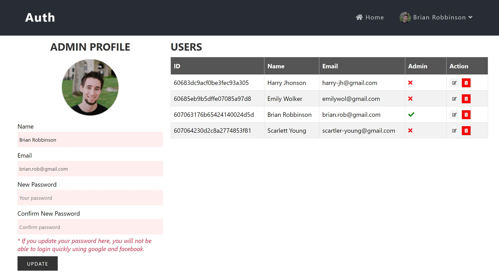

  <h3 style="margin-top: 50px; font-size: 35px">Home with login</h3>
  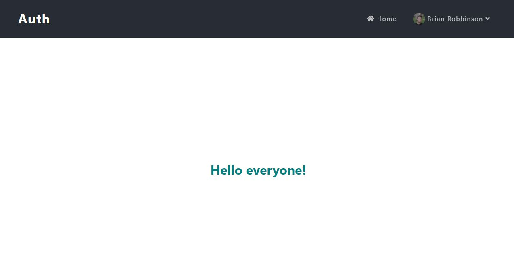

  <h3 style="margin-top: 50px; font-size: 35px">Home without login</h3>
  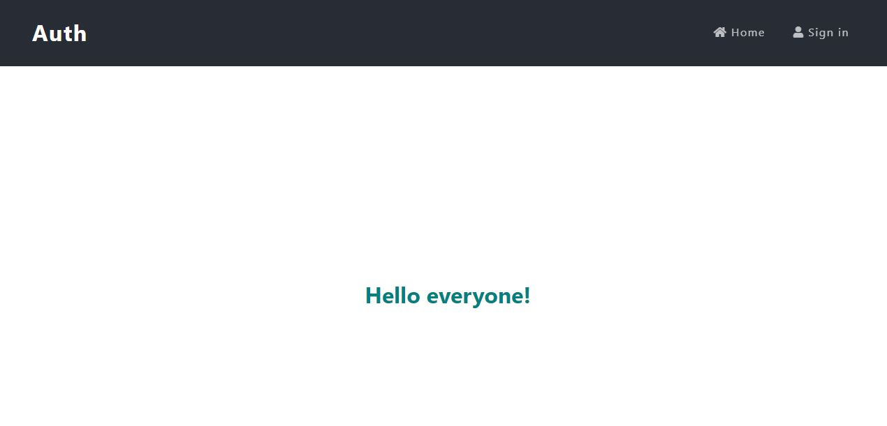

  <h3 style="margin-top: 50px; font-size: 35px">Login</h3>
  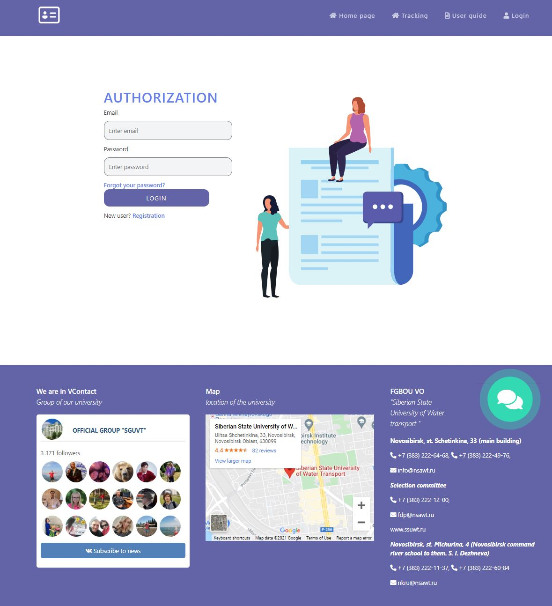

  <h3 style="margin-top: 50px; font-size: 35px">Register</h3>
  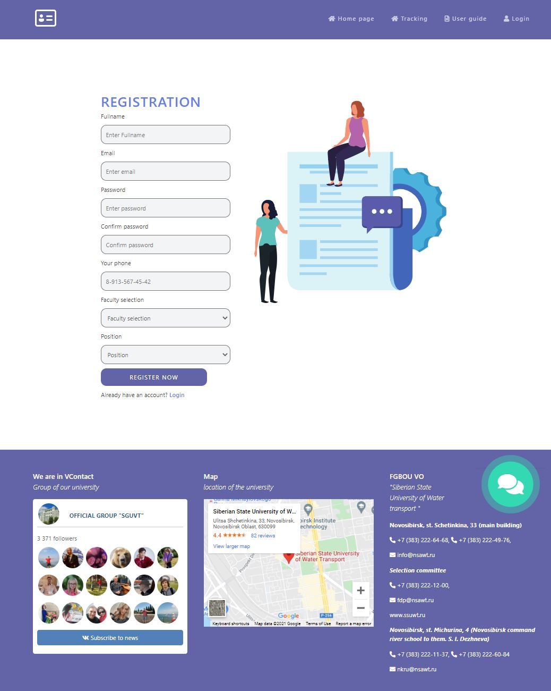

  <h3 style="margin-top: 50px; font-size: 35px">Validate register</h3>
  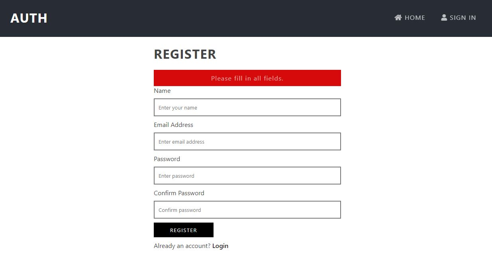

  <h3 style="margin-top: 50px; font-size: 35px">Forgot password</h3>
  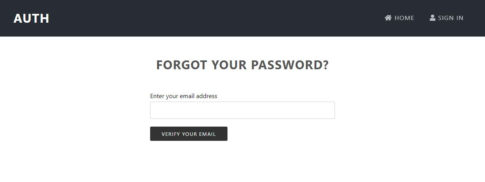
</div>

## Problems
